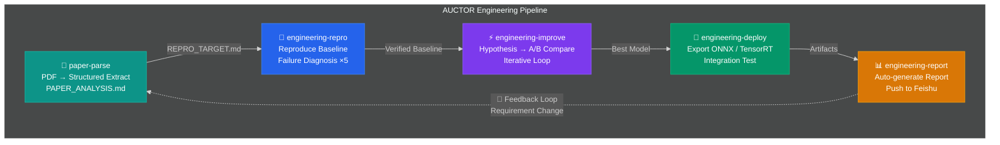

# AUCTOR — Automated Understanding, Code Testing, Optimization & Reproduction



> **让 AI Agent 帮你完成工程复现 → 改进 → 部署 → 汇报的全流程。** 醒来时发现论文已复现、指标已超越、模型已导出、报告已发出。
>
> 纯 Markdown Skills，零依赖，零锁定。每个 skill 是一个 `SKILL.md`，可在 Claude Code / Cursor / Codex CLI 中运行。

**Fork 自 [ARIS](https://github.com/wanshuiyin/Auto-claude-code-research-in-sleep)**，聚焦于**工程师的日常工作流**：从论文/需求出发，经过复现、改进、部署、汇报，到快速响应需求变更的闭环。

---

## 核心流程

```
论文 PDF / 需求文档
       │
       ▼
  /paper-parse          ← 结构化提取论文信息
       │
       ▼
  /engineering-repro    ← 复现 baseline（含失败诊断循环）
       │
       ▼
  /engineering-improve  ← 假设驱动的迭代改进
       │
       ▼
  /engineering-deploy   ← 模型导出 + 性能优化 + 验证
       │
       ▼
  /engineering-report   ← 自动生成汇报 + 飞书推送
       │
       ▼
  🔄 Feedback Loop      ← 需求变更 → 重新进入任意阶段
```

一键全流程：

```bash
/auctor-pipeline "复现并改进 TF-GridNet 在 WSJ0-2mix 上的语音分离"
```

---

## 快速上手

```bash
# 1. 克隆仓库
git clone https://github.com/ikou-austin/AUCTOR.git
cd AUCTOR

# 2. 安装 skills 到 Cursor / Claude Code
mkdir -p ~/.claude/skills/
cp -r skills/* ~/.claude/skills/

# 3. （可选）配置 Codex MCP 用于交叉审查
npm install -g @openai/codex
codex setup   # model 选 gpt-5.4
claude mcp add codex -s user -- codex mcp-server

# 4. 开始使用
# 在 Cursor / Claude Code 中：
> /paper-parse "https://arxiv.org/abs/2211.12433"
> /engineering-repro "TF-GridNet on WSJ0-2mix"
```

---

## Skills 一览

### 核心 Pipeline

| Skill | 作用 | 阶段 |
|-------|------|------|
| 📄 [`paper-parse`](skills/paper-parse/SKILL.md) | 解析论文 PDF，提取所有复现细节 → `PAPER_ANALYSIS.md` + `REPRO_TARGET.md` | 输入 |
| 🔬 [`engineering-repro`](skills/engineering-repro/SKILL.md) | 复现 baseline：代码搜索 → 环境搭建 → 训练 → 失败诊断循环（×5）→ 验证 | Stage 1 |
| ⚡ [`engineering-improve`](skills/engineering-improve/SKILL.md) | 假设驱动改进：提出改动 → A/B 对比 → accept/reject → 迭代 | Stage 2 |
| 🚀 [`engineering-deploy`](skills/engineering-deploy/SKILL.md) | 模型导出（ONNX/TensorRT）→ 性能优化 → 集成测试 → 部署验证 | Stage 3 |
| 📊 [`engineering-report`](skills/engineering-report/SKILL.md) | 收集指标 → 生成对比图表 → 写报告 → 飞书推送 | Stage 4 |
| 🔗 [`auctor-pipeline`](skills/auctor-pipeline/SKILL.md) | 编排以上所有阶段的全流程 | 全流程 |

### 辅助 Skills（保留自 ARIS）

| Skill | 作用 |
|-------|------|
| 📚 [`research-lit`](skills/research-lit/SKILL.md) | 多源文献搜索（arXiv + 本地 PDF + Web） |
| 📄 [`arxiv`](skills/arxiv/SKILL.md) | arXiv 论文搜索与下载 |
| 🔎 [`semantic-scholar`](skills/semantic-scholar/SKILL.md) | Semantic Scholar 搜索（IEEE/ACM 等正式发表论文） |
| 🚀 [`run-experiment`](skills/run-experiment/SKILL.md) | 部署实验到 Local / Remote SSH / Vast.ai GPU |
| 👀 [`monitor-experiment`](skills/monitor-experiment/SKILL.md) | 监控运行中的实验，收集结果 |
| 📊 [`analyze-results`](skills/analyze-results/SKILL.md) | 分析实验结果，生成统计和对比 |
| 📱 [`feishu-notify`](skills/feishu-notify/SKILL.md) | 飞书/Lark 通知推送 |
| 📐 [`mermaid-diagram`](skills/mermaid-diagram/SKILL.md) | Mermaid 图表生成 |
| 🔬 [`research-review`](skills/research-review/SKILL.md) | 交叉模型审查（GPT-5.4 xhigh） |

---

## 关键设计

### Agent Loop — 失败诊断循环

每个核心 skill 都内置 **Agent Loop**——AI 不是跑一次就结束，而是：

```
run → 检查结果 → 诊断失败原因 → 修复（每次只改一个变量）→ 重跑 → ...
```

如果达到 `MAX_RETRIES` 仍未成功，自动生成 `STUCK_REPORT.md` 并请求人工介入。

### Backbone ≠ Baseline

`paper-parse` 明确区分：

- **Backbone（基座模型）** — 你的新方法构建在什么之上。无代码论文复现的关键。
- **Baseline（基线对照组）** — 结果表里的比较数字。不同架构，仅供参考。

### 跨模型协作

- **Executor**：Claude Code / Cursor / Codex CLI 驱动执行
- **Reviewer**：GPT-5.4 / Gemini / MiniMax 提供独立审查

单模型自审容易陷入盲区，跨模型对抗式审查效果更好。

---

## 项目结构

```
AUCTOR/
├── skills/                    # 所有 Skill（核心 + 辅助）
│   ├── paper-parse/           # 📄 论文解析
│   ├── engineering-repro/     # 🔬 工程复现
│   ├── engineering-improve/   # ⚡ 工程改进
│   ├── engineering-deploy/    # 🚀 工程部署
│   ├── engineering-report/    # 📊 工程汇报
│   ├── auctor-pipeline/       # 🔗 全流程编排
│   └── ...                    # 辅助 skills
├── templates/                 # 模板文件
│   ├── PAPER_REPRO_TARGET_TEMPLATE.md
│   └── PAPER_REPRO_PLAN_TEMPLATE.md
├── docs/                      # 文档和图片
│   ├── auctor_pipeline.svg    # 流程图
│   ├── CURSOR_ADAPTATION.md   # Cursor 适配指南
│   └── ...
├── mcp-servers/               # MCP 服务（llm-chat 等）
├── tools/                     # 辅助脚本
└── tests/                     # 测试
```

---

## 使用示例

### 示例 1：解析论文 + 复现

```bash
# Step 1: 解析论文，提取所有实验细节
/paper-parse "https://arxiv.org/abs/2211.12433"

# Step 2: 基于 REPRO_TARGET.md 开始复现
/engineering-repro "TF-GridNet speech separation"

# Step 3: 改进 baseline
/engineering-improve "TF-GridNet"

# Step 4: 导出部署
/engineering-deploy "TF-GridNet"

# Step 5: 生成汇报
/engineering-report
```

### 示例 2：一键全流程

```bash
/auctor-pipeline "复现并优化 TF-GridNet，导出 ONNX，生成中文汇报"
```

### 示例 3：快速需求变更

```bash
# 需求方说："换个数据集试试 WHAMR!"
# 直接修改 REPRO_TARGET.md，然后：
/engineering-repro "TF-GridNet on WHAMR!"
# Agent Loop 自动处理环境/数据/超参差异
```

---

## GPU 配置

在项目根目录的 `AUCTOR.md` 或 `CLAUDE.md` 中配置：

```markdown
## GPU
- **type**: local          # local / remote / vast
- **server**: user@gpu-server
- **conda_env**: py312-torch
- **gpu_ids**: 0,1
```

支持：
- **本地 GPU** — 直接运行
- **远程服务器** — SSH + rsync + screen
- **[Vast.ai](https://vast.ai)** — 按需租用，自动销毁

---

## 配置覆盖

所有 skill 参数都可以通过命令行覆盖：

```bash
/engineering-repro "method" — max retries: 8, tolerance: 0.05, code review: false
/paper-parse "paper.pdf" — depth: quick, language: en
/engineering-report — format: executive, push feishu: true
```

---

## 上游致谢

本项目 fork 自 **[ARIS (Auto-claude-code-Research-In-Sleep)](https://github.com/wanshuiyin/Auto-claude-code-research-in-sleep)**，保留了其核心的 Markdown-driven skill 架构和跨模型协作理念。AUCTOR 在此基础上聚焦于工程落地场景。

## License

MIT — 参见 [LICENSE](LICENSE)。
