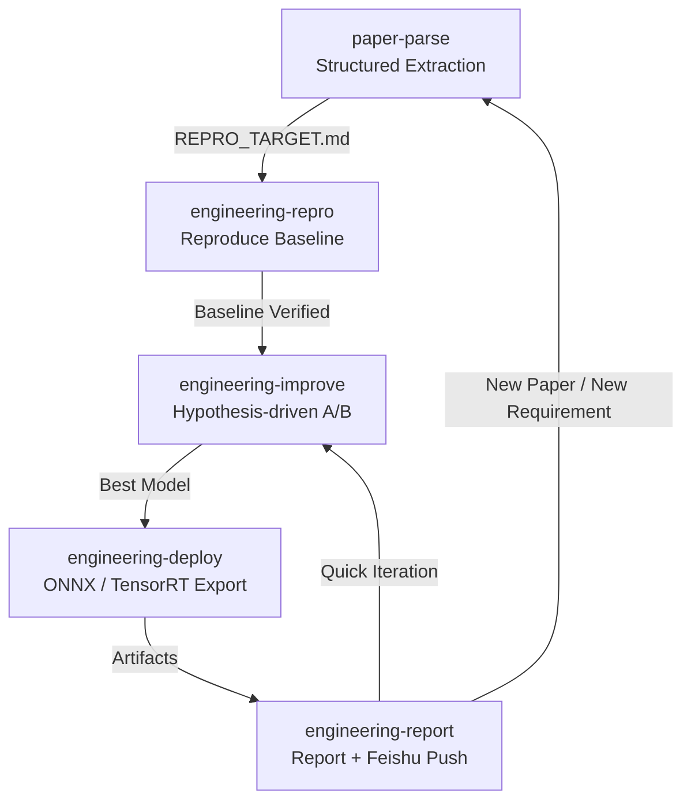
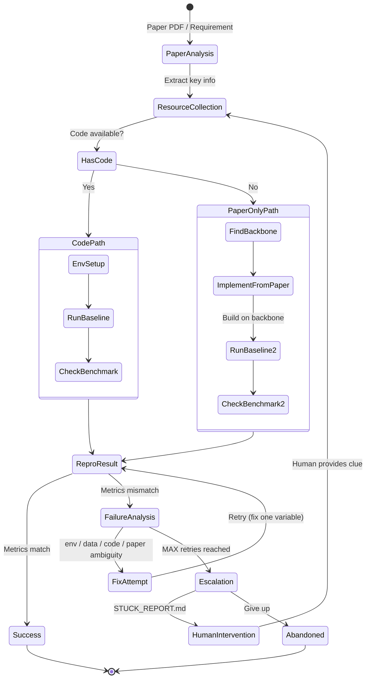

[English](README_EN.md) | [中文](README.md)

# AUCTOR — Automated Understanding, Code Testing, Optimization & Reproduction


### Pipeline Overview



### engineering-repro State Machine



> **Let AI Agents handle the full pipeline: reproduce → improve → deploy → report.** Wake up to find the paper reproduced, metrics surpassed, model exported, and report delivered.
>
> Pure Markdown Skills, zero dependencies, zero lock-in. Each skill is a single `SKILL.md`, runnable in Claude Code / Cursor / Codex CLI.

**Forked from [ARIS](https://github.com/wanshuiyin/Auto-claude-code-research-in-sleep)**, focused on **the engineer's daily workflow**: from paper/requirement to reproduction, improvement, deployment, reporting, and rapid iteration on requirement changes.

---

## Core Pipeline

**Pipeline Overview** shows the 5-stage pipeline with feedback loops. **State Machine** details the most complex skill, `engineering-repro` — dual path (with/without code), failure diagnosis loop, and human escalation gate.

1. **paper-parse** — Structured extraction from paper (backbone vs baseline, datasets, hyperparams, metrics) → `PAPER_ANALYSIS.md` + `REPRO_TARGET.md`
2. **engineering-repro** — Dual-path reproduction: clone + env setup if code exists, find backbone + implement from paper if not. Built-in **Agent Loop**: failure → auto-diagnose (env / data / code / paper ambiguity) → fix one variable at a time → retry, up to N times. Generates `STUCK_REPORT.md` for human escalation when exhausted.
3. **engineering-improve** — Hypothesis-driven A/B iterative improvement (single-variable control), Accept/Reject each hypothesis
4. **engineering-deploy** — Model export (ONNX / TensorRT) + integration tests + failure repair loop
5. **engineering-report** — Collect all metrics → comparison charts → report → Feishu/Lark push
6. **Feedback Loop** — Quick iteration back to improve on requirement changes, back to parse on new papers/requirements

One-command full pipeline:

```bash
/auctor-pipeline "Reproduce and improve TF-GridNet on WSJ0-2mix speech separation"
```

---

## Quick Start

```bash
# 1. Clone the repo
git clone https://github.com/ikou-austin/AUCTOR.git
cd AUCTOR

# 2. Install skills to Cursor / Claude Code
mkdir -p ~/.claude/skills/
cp -r skills/* ~/.claude/skills/

# 3. (Optional) Configure Codex MCP for cross-model review
npm install -g @openai/codex
codex setup   # select gpt-5.4
claude mcp add codex -s user -- codex mcp-server

# 4. Start using
# In Cursor / Claude Code:
> /paper-parse "https://arxiv.org/abs/2211.12433"
> /engineering-repro "TF-GridNet on WSJ0-2mix"
```

---

## Skills Overview

### Core Pipeline

| Skill | Description | Stage |
|-------|-------------|-------|
| 📄 [`paper-parse`](skills/paper-parse/SKILL.md) | Parse paper PDF, extract all reproduction details → `PAPER_ANALYSIS.md` + `REPRO_TARGET.md` | Input |
| 🔬 [`engineering-repro`](skills/engineering-repro/SKILL.md) | Reproduce baseline: code search → env setup → train → failure diagnosis loop (×5) → verify | Stage 1 |
| ⚡ [`engineering-improve`](skills/engineering-improve/SKILL.md) | Hypothesis-driven improvement: propose change → A/B compare → accept/reject → iterate | Stage 2 |
| 🚀 [`engineering-deploy`](skills/engineering-deploy/SKILL.md) | Model export (ONNX/TensorRT) → perf optimization → integration test → deploy verification | Stage 3 |
| 📊 [`engineering-report`](skills/engineering-report/SKILL.md) | Collect metrics → comparison charts → write report → Feishu push | Stage 4 |
| 🔗 [`auctor-pipeline`](skills/auctor-pipeline/SKILL.md) | Orchestrate all stages end-to-end | Full Pipeline |

### Auxiliary Skills (from ARIS)

| Skill | Description |
|-------|-------------|
| 📚 [`research-lit`](skills/research-lit/SKILL.md) | Multi-source literature search (arXiv + local PDF + Web) |
| 📄 [`arxiv`](skills/arxiv/SKILL.md) | arXiv paper search and download |
| 🔎 [`semantic-scholar`](skills/semantic-scholar/SKILL.md) | Semantic Scholar search (IEEE/ACM formal publications) |
| 🚀 [`run-experiment`](skills/run-experiment/SKILL.md) | Deploy experiments to Local / Remote SSH / Vast.ai GPU |
| 👀 [`monitor-experiment`](skills/monitor-experiment/SKILL.md) | Monitor running experiments, collect results |
| 📊 [`analyze-results`](skills/analyze-results/SKILL.md) | Analyze experiment results, generate statistics and comparisons |
| 📱 [`feishu-notify`](skills/feishu-notify/SKILL.md) | Feishu/Lark notification push |
| 📐 [`mermaid-diagram`](skills/mermaid-diagram/SKILL.md) | Mermaid diagram generation |
| 🔬 [`research-review`](skills/research-review/SKILL.md) | External LLM review (optional, e.g. pre-deployment code review) |

---

## Key Design Principles

### Agent Loop — Failure Diagnosis Cycle

Every core skill has a built-in **Agent Loop** — the AI doesn't just run once and stop:

```
run → check result → diagnose failure → fix (one variable at a time) → re-run → ...
```

If `MAX_RETRIES` is reached without success, it generates `STUCK_REPORT.md` and requests human intervention.

### Backbone ≠ Baseline

`paper-parse` explicitly distinguishes:

- **Backbone** — The foundation your new method builds upon. Critical for reproducing paper-only (no-code) work.
- **Baseline** — Comparison numbers in the results table. Different architectures, for reference only.

### FROZEN_SPEC — Experiment Fairness Lock

After successful reproduction, `engineering-repro` generates `FROZEN_SPEC.md`, **locking two things**:

| Locked Item | Policy | On Violation |
|-------------|--------|-------------|
| **Data Preparation** (dataset, preprocessing, splits) | Fully frozen | Refuse to run, warn user |
| **Evaluation Protocol** (metrics, eval script, test set) | Fully frozen | Refuse to run, warn user |
| **Data Augmentation** (noise, reverb, speed, etc.) | Needs user approval | Ask user; if approved, baseline must be re-run with same augmentation |

The improvement phase can only modify: feature extraction, model architecture, training algorithm, hyperparameters, loss function. Data and evaluation stay untouched, ensuring fair comparison.

### Single Agent, Continuous Context

Engineering reproduction and improvement are **highly context-dependent** tasks — the reason behind each debugging attempt, the outcome of each retry, and the pitfalls of the environment all form critical information for subsequent decisions. Different models/agents don't share context; forcing a split only loses information.

AUCTOR's core design: **one agent runs the entire pipeline**, from paper parsing through reproduction debugging to iterative improvement, maintaining continuous context throughout. This is more effective than splitting work across multiple agents that don't share memory.

---

## Project Structure

```
AUCTOR/
├── skills/                    # All Skills (core + auxiliary)
│   ├── paper-parse/           # 📄 Paper parsing
│   ├── engineering-repro/     # 🔬 Engineering reproduction
│   ├── engineering-improve/   # ⚡ Engineering improvement
│   ├── engineering-deploy/    # 🚀 Engineering deployment
│   ├── engineering-report/    # 📊 Engineering reporting
│   ├── auctor-pipeline/       # 🔗 Full pipeline orchestration
│   └── ...                    # Auxiliary skills
├── templates/                 # Template files
│   ├── PAPER_REPRO_TARGET_TEMPLATE.md
│   └── PAPER_REPRO_PLAN_TEMPLATE.md
├── docs/                      # Documentation and assets
│   ├── CURSOR_ADAPTATION.md   # Cursor adaptation guide
│   └── ...
├── mcp-servers/               # MCP services (llm-chat, etc.)
├── tools/                     # Utility scripts
└── tests/                     # Tests
```

---

## Usage Examples

### Example 1: Parse Paper + Reproduce

```bash
# Step 1: Parse paper, extract all experiment details
/paper-parse "https://arxiv.org/abs/2211.12433"

# Step 2: Start reproduction based on REPRO_TARGET.md
/engineering-repro "TF-GridNet speech separation"

# Step 3: Improve baseline
/engineering-improve "TF-GridNet"

# Step 4: Export and deploy
/engineering-deploy "TF-GridNet"

# Step 5: Generate report
/engineering-report
```

### Example 2: One-Command Full Pipeline

```bash
/auctor-pipeline "Reproduce and optimize TF-GridNet, export ONNX, generate report"
```

### Example 3: Quick Requirement Change

```bash
# Stakeholder says: "Try a different dataset — WHAMR!"
# Edit REPRO_TARGET.md, then:
/engineering-repro "TF-GridNet on WHAMR!"
# Agent Loop automatically handles env/data/hyperparam differences
```

---

## GPU Configuration

Configure in `AUCTOR.md` or `CLAUDE.md` at the project root:

```markdown
## GPU
- **type**: local          # local / remote / vast
- **server**: user@gpu-server
- **conda_env**: py312-torch
- **gpu_ids**: 0,1
```

Supported:
- **Local GPU** — Direct execution
- **Remote Server** — SSH + rsync + screen
- **[Vast.ai](https://vast.ai)** — On-demand rental, auto-destroy

---

## Configuration Override

All skill parameters can be overridden via command line:

```bash
/engineering-repro "method" — max retries: 8, tolerance: 0.05, code review: false
/paper-parse "paper.pdf" — depth: quick, language: en
/engineering-report — format: executive, push feishu: true
```

---

## Acknowledgments

Forked from **[ARIS (Auto-claude-code-Research-In-Sleep)](https://github.com/wanshuiyin/Auto-claude-code-research-in-sleep)**, preserving its core Markdown-driven skill architecture and cross-model collaboration philosophy. AUCTOR refocuses on engineering deployment scenarios.

## License

MIT — See [LICENSE](LICENSE).
